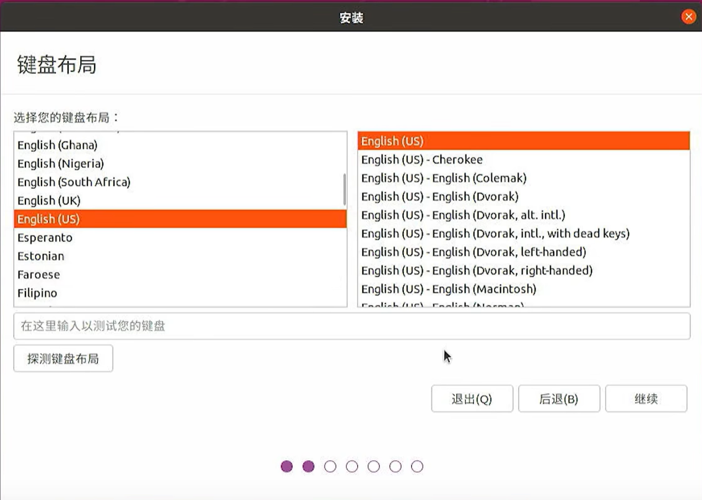
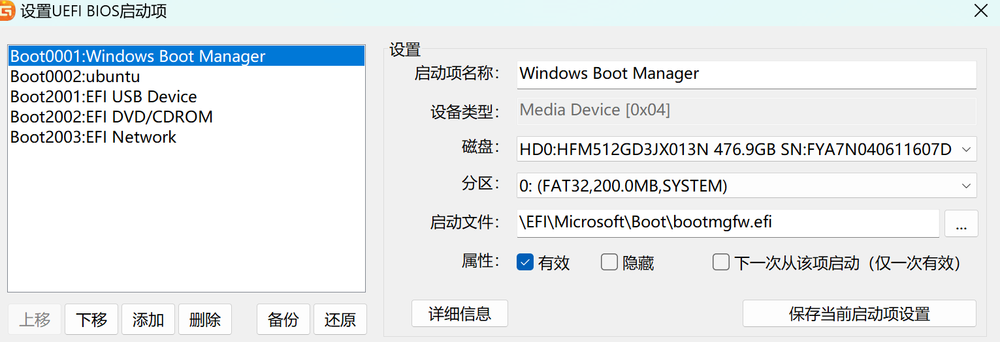

# Linux-Windows双系统的搭建，使用移动硬盘  
由于学校项目需要，因此着手安装20.04LTS版本的Ubuntu，安装双系统而不是使用虚拟机安装。  

这里由于笔者的电脑空间实在是太小，C盘只剩10G，D盘只剩100G，因此考虑在移动硬盘中安装Ubuntu。网上移动硬盘安装Ubuntu的教程鱼龙混杂，为了备不时之需，笔者在此写下一些注意事项。  
## <1>下载Ubuntu20.04LTS版本的.iso文件
首先上Ubuntu的官网，可以看见只有22/23版本的Ubuntu  
<https://ubuntu.com/download/desktop>  

接着我们点击右侧蓝色小字**see out alternative downloads**，出现以下图片  

点击**Ubuntu 20.04 LTS (Focal Fossa)**，出现以下界面  

点击**64-bit PC (AMD64) desktop image**，即可开始下载，耐心等待下载完毕
## <2>制作U盘启动盘（请先备份重要文件，会需要格式化）
注意，不要以为在移动硬盘里面装Ubuntu就可以不用U盘做启动盘了！如果偷懒，装Ubuntu的时候系统根本不会识别到你的移动硬盘，***即使你对移动硬盘做了分区***  

因此，需要准备一个16GB以上的U盘，并且下载刻录软件**Rufus**  
下载链接<https://rufus.ie/zh/>  

选择**rufus-4.4p.exe**，下完打开

***如果使用的是U盘制作启动盘，如下图***，那么Rufus会自动识别你的U盘，但是如果使用的是移动硬盘做启动盘（注意这个移动硬盘不是装Ubuntu的盘，仅仅作为启动盘），Rufus不会自动识别  

***如果使用的是移动硬盘制作启动盘，如下图***，那么我们需要打开**显示高级设备选项**，勾选**显示USB外接硬盘**

**下面两种模式都相同**  
我们选择相应的.iso文件，保持持久分区为0  
关于分区类型，我们在cmd窗口中输入指令`msinfo32`，自动打开系统信息

可以看到笔者这里是UEFI模式，那么我们的分区类型就选择GPT，否则就选择MBR

下面是格式化环节，***请将盘内重要文件备份***  
卷标可以自己定一个，没有特殊要求，文件系统和簇大小请保持默认

然后点击开始，等待时间取决于盘的读写速度，U盘慢一点，移动硬盘比较快。刻录结束后，点击关闭，关闭Rufus。可以看见Rufus所在目录多了一个文件夹和一个.ini的配置文件，每次用都会有，放心删除，不影响使用。  
## <3>移动硬盘的分区
首先下载磁盘精灵DiskGenius，安装包笔者放在仓库里。下载解压后双击.exe文件运行  
我们在左侧边栏中选中我们的移动硬盘，这里笔者是HD1:Lexar(932GB)那个，其次我们选中剩余的空间，右键点击**建立新分区**，***（如果你是新的移动硬盘，那么也同样操作，在建立新分区的时候可能会提示让你建立ESP和MSR分区，建议是建立一下）***

出现以下画面，假设我们给Ubuntu100GB的空间，设置好点击开始

然后我们在左侧的100GB空间上右键选择删除当前分区，使该分区保持空闲  
***下面的分区内容详情<https://www.cnblogs.com/consistency/p/17838414.html>中的分区设置部分（因为笔者没法截图hhh，移动硬盘里有东西了不再做一次新的分区了）***，只不过笔者建议在前面设置空闲分区  
对于`efi` `swap` `\` `\home`这四个分区，笔者设置的大小如下：  
- `efi` 笔者设置了2G，1-2GB为宜，文件系统类型FAT32，簇大小不变，卷标efi
- `swap` 笔者设置了16G，建议和电脑的内存差不多大小，文件系统类型Linux swap，簇大小不变，卷标不设置，也不能设置
- `\` 笔者设置了20G，文件系统类型Ext4(Linux Data)，簇大小不变，卷标\
- `\home` 笔者设置了剩下的62G，尽量大一点吧，各种下载的文件也会出现在这里，文件系统类型Ext4(Linux Data)，簇大小不变，卷标\home  

然后，我们点击左上角的保存更改，完成分区
## <4>安装Ubuntu  
在安装Ubuntu之前，请使用手机或者平板将此教程保存，进入了BIOS就看不见啦，然后记住刚刚分区的名字和大小，记住自己移动硬盘的大小。  

然后关闭Windows，重启电脑，在开始重新启动之前，使用自己电脑进入BIOS的快捷键进入BIOS，笔者电脑是华为，快捷键F2，即在启动前狂按F2，进入以下界面，这里借用网络图片，移动到Secure Boot处，关闭它，即设置为Disable，***否则无法从刚刚的使用Rufus制作的启动盘启动***  

然后按F10保存并退出，此时狂按F12，进入以下界面，借网图，我们选择除Windows Boot Manager的另外一项，按回车进入  

然后即可看见grub界面，我们选择第一项Try or Install Ubuntu，如果错误地选了Ubuntu之类也没关系，我们进入Ubuntu后会在桌面上有安装程序，双击运行即可

选择安装Ubuntu，笔者用的是中文，不过现在看来建议选择英文

  

设置键盘布局，选择English(US)

如果网速够快，可以选择连接网络，不连也没有关系

选择正常安装，如果网速好，在其他选项中可以选择安装Ubuntu时下载更新，否则不要选任何选项，会很慢

安装类型选择其他选项，因为我们刚刚已经划分好了分区，只需选择即可。注意，不要选择第一或者第二项，因为有可能直接把Windows系统给吞掉，比较危险

在安装类型这里，我们首先找到我们刚刚在DiskGenius里面制作的4个分区，找到efi对应的分区，将安装启动引导器的设备改为efi对应的设备。其次，我们设置这4个分区的细节
-  `efi` 大小无需修改，类型选择 efi 类型，挂载点不选
- `swap` 大小无需修改，类型选择 swap 类型，挂载点不选
- `/` 大小无需修改，类型选择 ext4 日志文件系统，挂载点选择 /
- `/home` 大小无需修改，类型选择 ext4 日志文件系统，挂载点选择 /home

设置完毕后点击安装，设置时区默认在上海

然后输入姓名与计算机名，注意姓名是Ubuntu中terminal中@符号前部的字符串，计算机名为@符号后面的字符串，建议都设置简单一点，不然会比较丑比较别扭qwq  

然后设置密码之类，点继续

然后耐心等待安装完成...**之后要先拔出U盘，然后重启系统**  
### 先拔U盘！！！
否则会死机，不停error，只能强制关机，然后安装完成  
## <5>疑难杂症
### #1 出现grub系统  
如果装完系统打算拔掉移动硬盘使用Windows，就会出现这种grub系统！  

这种原因很可能是装了Ubuntu后，默认设置了Ubuntu作为第一启动项，但是现在又没有插入移动硬盘，grub系统不知道要启动什么系统了，就一直处于等待状态  
\# 其中一个解决方法见网页<https://www.cnblogs.com/consistency/p/17838414.html>  

\# 另一个解决方法是在grub界面输入命令`exit`，然后出其不意狂按F12选择进入Windows，该方法需要熟练把控时间火候  

\# 笔者使用的解决方法是  
- 使用ls命令，查看当前有哪些分区
- 使用ls命令，找到 `/efi/Microsoft/Boot/bootmgfw.efi`文件所在的分区`(hd_,_)`  
- 输入命令 `set root = (hd_,_)`，注意如果出现带有gpt的分区，gpt可以省略  
- 输入命令 `chainloader /efi/Microsoft/Boot/bootmgfw.efi`  
- 输入命令 `boot`  

成功进入Windows，关于这些指令的具体解释，详见这篇<https://blog.csdn.net/hikkilover/article/details/82290873>  

接着如果使用Windows作为主系统，那么我们肯定希望如果不插移动硬盘也能默认进入Windows，这就需要我们修改Ubuntu和Windows的启动顺序。如果是其余品牌的电脑，那么我们重启进入BIOS系统修改Boot Sequence，将Windows放在第一位即可。***但是，很不幸，笔者使用的是HUAWEI Matebook***，不支持修改启动顺序，也就是说在BIOS系统中没有修改启动顺序的选项。  
如果我们需要强行修改，我们需要重启电脑，进入Windows系统，打开DiskGenius，光标移至“工具”，点击设置UEFI BIOS启动项    
  

将Windows Boot Manager移至ubuntu上方即可

### #2 Ubuntu与Windows系统时间不同步，Clash没法用  
安装完ubuntu发现Windows的时间直接前移了8小时！尝试修改Windows系统时间，但是再次使用完ubuntu后开机发现时间还是错的，clash不能使用了  

究其原因，Windows系统认为BIOS时间就是系统时间，但是Ubuntu认为BIOS时间是格林尼治时间，也就是标准时间，而中国上海位于东八区，要加上8小时。两个系统一旦打开并且联网，就会自动校准时间，并且根据自身的规则去修改BIOS的时间。因此，光调单个系统的时间是没有用的  

我们打开Ubuntu的终端，输入指令`timedatectl status`,我们可以查看当前Ubuntu的时钟设置，比较关键的是NTP service和RTC in local TZ，下图是修改前，我们需要将NTP service修改为inactive，将RTC in local TZ修改为yes  

因此，输入指令`sudo timedatectl set-local-rtc 1 --adjust-system-clock`，注意一定要加上`--adjust-system-clock`，否则设置失败，知乎文章<https://zhuanlan.zhihu.com/p/492885761>适用于较老的Ubuntu版本，更详细的其他方法见文章<https://blog.csdn.net/X_T_S/article/details/110142773>，本篇不作解释了  

其次，输入指令`sudo timedatectl set-ntp off` 来关闭NTP服务

修改后，再次输入指令`timedatectl status`，可见NTP service已经修改为inactive，RTC in local TZ已经修改为yes  

## <6>Linux系统下Clash For Windows的配置  
首先下载Clash For Windows对应的linux版本，这里笔者放在仓库里面(不放了，不想搞git LFS)，后缀为.tar.gz，我们将该压缩包导入Ubuntu，在终端中依次输入以下代码  

    # 解压
    tar -zxvf Clash.for.Windows-x64-linux.tar.gz
    # 重命名
    sudo mv Clash.for.Windows-x64-linux /usr/local/bin/clash
    # 为 clash 添加可执行权限
    sudo chmod +x /usr/local/bin/clash
    # 进入clash目录
    cd /usr/local/bin/clash
    # 执行cfw命令，即可打开clash界面
    ./cfw

随后打开开机自启选项，并在侧边栏“配置”中复制代理的URL，并且点击下载  

接着打开设置，选择网络，设置网络代理模式，选择手动，在HTTP代理/HTTPS代理/Socks主机前一栏中填入127.0.0.1，后一侧填入7890，忽略主机不变  
**Clash配置完成**  

接下来我们为Clash创建应用程序，否则每次打开clash都需输入相应命令或者打开相应文件夹  

    # 进入用户应用程序目录
    cd ~/.local/share/applications
    # 创建clash应用程序
    touch clash.desktop
    # 将以下代码粘贴到 clash.desktop 中
    [Desktop Entry]
    Name=clash for windows
    # 注意这里的clash.png，自己在网上下一张图即可
    Icon=~/Documents/clash.png
    Exec=/usr/local/bin/clash
    Type=Application
    # 添加可执行权限
    chmod +x clash.desktop  

**可视化图标设置完成**
